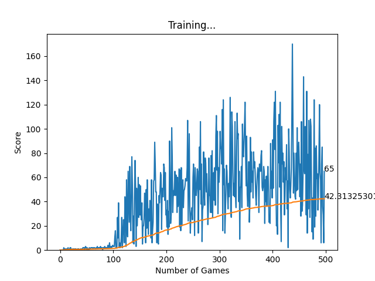

# Snake-ML

This project is a Python implementation of a reinforcement learning (RL) agent that learns to play the Snake game using Deep Q-Networks (DQNs). The project follows the methodology outlined in [this article](https://medium.com/@nancy.q.zhou/teaching-an-ai-to-play-the-snake-game-using-reinforcement-learning-6d2a6e8f3b1c).

https://github.com/user-attachments/assets/f8098a40-79b7-4756-8690-940492df0da1

## Overview

In this project, I have implemented a Snake game and an RL agent using PyTorch. The agent uses a DQN to learn the optimal policy for playing the game. The key components of the project are:

- **Snake Game**: The classic Snake game implemented using Pygame.
- **Deep Q-Network (DQN)**: A neural network model that approximates the Q-values for state-action pairs.
- **Q-Learning Algorithm**: The agent uses Q-learning with experience replay to learn from its interactions with the game.

## Key Differences from the Article

While the article uses an output size of 3 (representing the actions: straight, left, right), our implementation uses an output size of 4, representing the actions: up, down, left, and right. This allows for more flexibility in the snake's movements but also adds complexity to the learning process.

## Current Model Performance

The current model shows fluctuations in the scores as it plays the game. The learning process is still ongoing, and the agent's performance varies across different iterations. Below is a graph showing the agent's scores over multiple iterations:



## Project Structure

- `game.py`: Contains the implementation of the Snake game using Pygame.
- `agent.py`: Contains the implementation of the RL agent, including the DQN model, Q-learning algorithm, and experience replay.

## How to Run

1. **Clone the repository**:

   ```bash
   git clone https://github.com/your-username/snake-ml.git
   cd snake-ml
   ```

2. **Install the dependencies**:

   ```bash
   pip install -r requirements.txt
   ```

3. **Run the Snake game with the RL agent**:

   ```bash
   make agent
   ```

4. **Run the Snake game normally**:
   ```bash
   make game
   ```

The agent will start training and you will see the game being played by the agent. The performance of the agent will be displayed in the terminal, and a plot of the scores will be shown.

## Acknowledgments

This project is inspired by the article [Teaching an AI to play the Snake game using Reinforcement Learning](https://medium.com/@nancy.q.zhou/teaching-an-ai-to-play-the-snake-game-using-reinforcement-learning-6d2a6e8f3b1c) by Nancy Q. Zhou.
